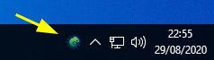

# Task tray button

Displays a button on the task tray, by shrinking the window list and positioning itself between that and the
notification area.

This looks and smells like a notification icon, but it's always visible.

The taskbar is a window, having child windows like this: 

    [start][search][windows                 ][icons|clock]

The tray button is just another child window, inserted between the window list and icons:

    [start][search][windows         ][button][icons|clock]

## Why??

The primary audience for [Morphic](https://morphic.world) is people who have difficulties using a computer. Accessing
the software needs to be easy to perform and not change.

A standard notification icon will hide itself in a non-discoverable place, and the method of preventing this
(programatically) has been purposefully stopped..

## History

This was extracted from the original Morphic application, [gpii-app/trayButton](https://github.com/GPII/gpii-app/tree/master/trayButton).

Original PoC: [stegru/tray-button](https://github.com/stegru/tray-button)

## Build

Run `build.ps1`, or use Visual Studio.

## Operation

### Control

It is controlled by the parent process via standard input, with the following commands:

Set the icon to `file`:

    ICON file

Set the high-contrast icon to `file`:
    
    ICON_HC file

Set the tooltip `text`:

    TOOLTIP text

Specify a window handle `hwnd` belonging to the parent process, to focus when the button is clicked:

    HWND hwnd

Set the checked state to `bool`:

    STATE bool

Remove the icon, re-adjust the taskbar, and end the process:

    DESTROY

### Events

The tray-button process will produce the following notifications on its standard output:

* `CLICK`: The left button is clicked.
* `SHOWMENU`: The right button is clicked.
* `MOUSEENTER`, `MOUSELEAVE`: The mouse cursor has entered or left the button.
* `POSITION MAKELONG(x,y) MAKELONG(w,h): Position of the button has changed.
* `UPDATE`: Configuration is required.
